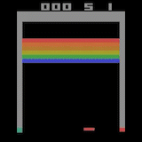

# Breakout

The AI learns to play Breakout thanks to LSTM-A3C (Deep Convolutional Q-learning with Long Short-Term Memory and Asynchronous Advantage Actor-Critic).

For the game environment, it uses [gym](https://github.com/openai/gym).

For the model, it uses the Neural Network module from PyTorch, more precisely :
- 4 convolutions
- an actor neural network
- a critic neural network
- a LSTM cell
- the ELU rectifier function
- a shared Adam optimizer
- the softmax and log_softmax function for probability distribution
- the zero_grad function for stochastic gradient descent
- a custom computation of the Advantage, which is the difference between the Value and Policy loss functions