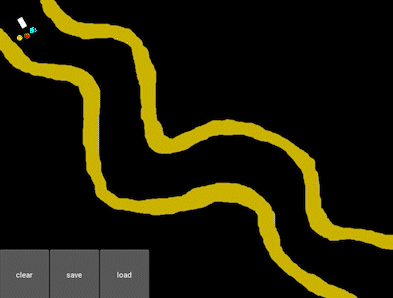

# Self-driving car

Draw a custom road and the AI will learn how to drive thanks to Deep Q-Learning.

For the car and environment, it uses [Kivy](https://github.com/kivy/kivy).

For the model, it uses the Neural Network module from PyTorch, more precisely :
- 30 hidden layers
- the ReLU rectifier function
- the Adam optimizer
- the softmax function for probability distribution
- the smooth_l1_loss function for temporal difference
- the zero_grad function for stochastic gradient descent
- a custom Experience Replay memory